```{r setup, include=FALSE}
knitr::opts_chunk$set(echo = FALSE)
library(here)
```

Halina Do-Linh achieved a Bachelor’s Degree in Environmental Studies & Biology from the University of California, Santa Cruz (UCSC). There she grew her interests in sustainable development, field research and conservation.

<center>

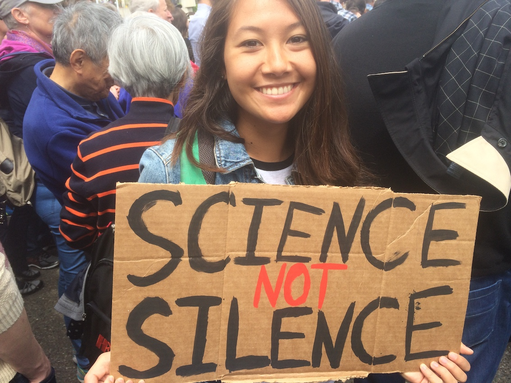{width="70%"}
</center>

Her interest in an environmental career was solidified after researching green and hawksbill sea turtles in Baja California through the Ecology and Conservation Supercourse field quarter at UC Santa Cruz.

<center>

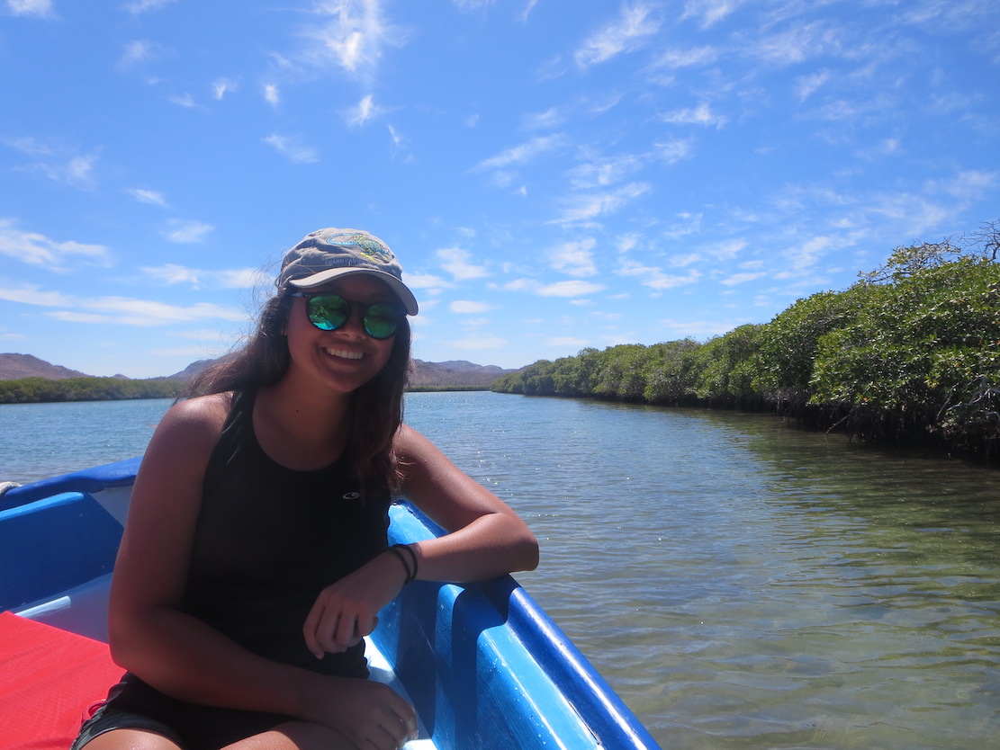{width="30%"} 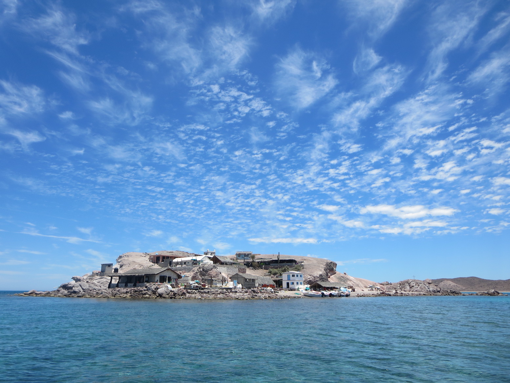{width="30%"} 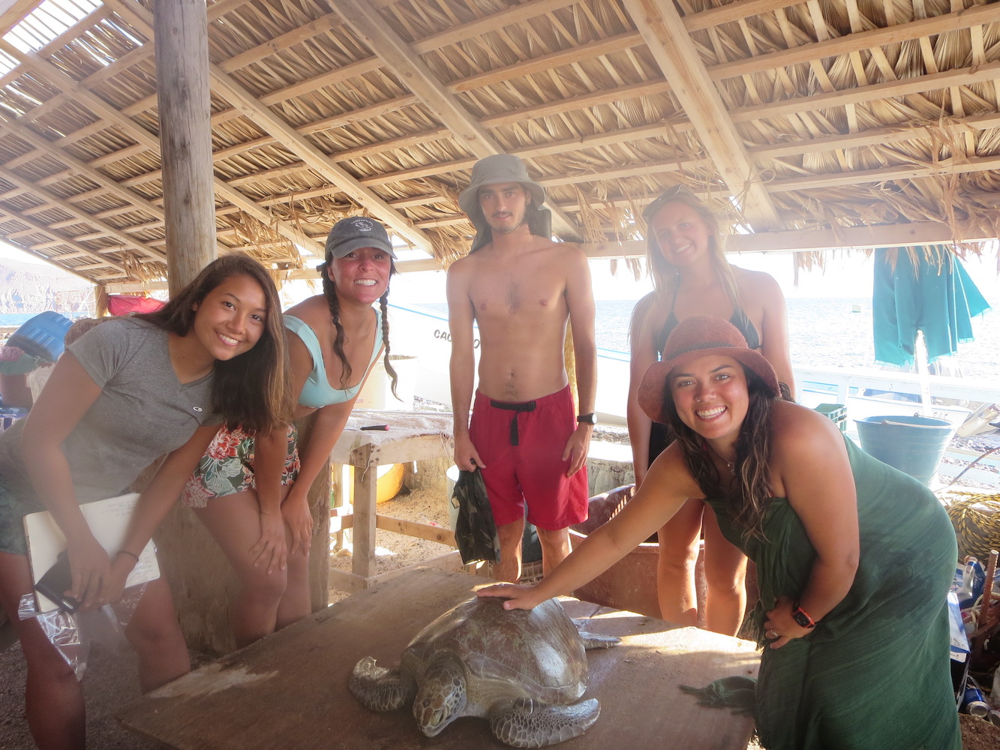{width="30%"}
</center>

After graduating, Halina applied her field research skills to outdoor education, where she taught environmental topics to K-12 students and later, field research methods to University of California undergraduates. 

<center>

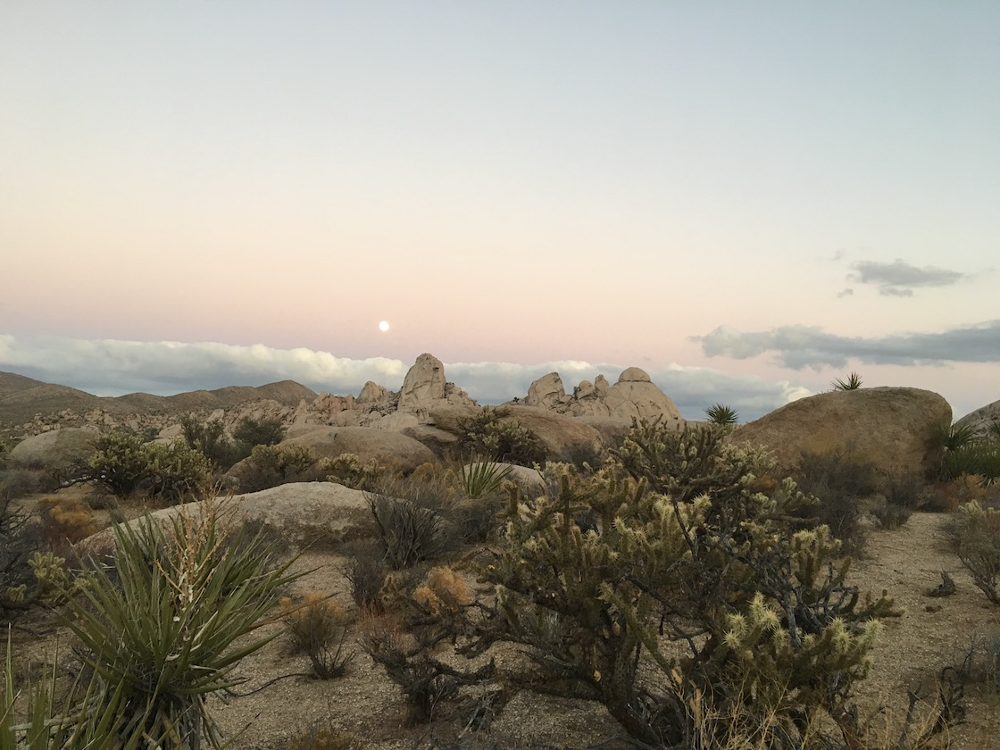{width="30%"} 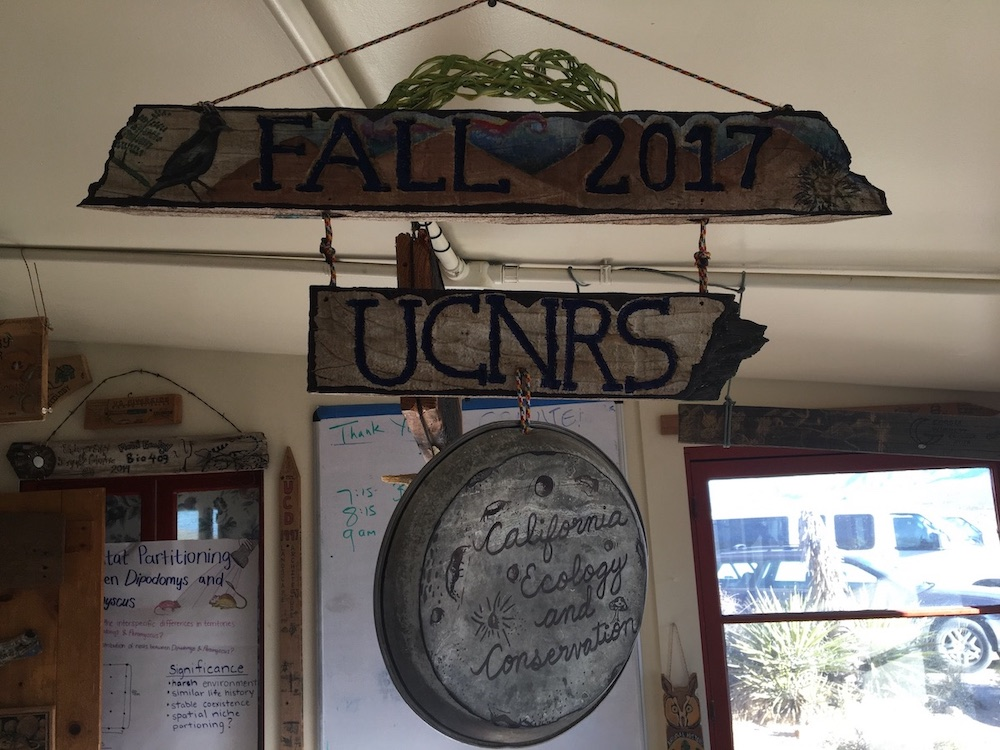{width="30%"} 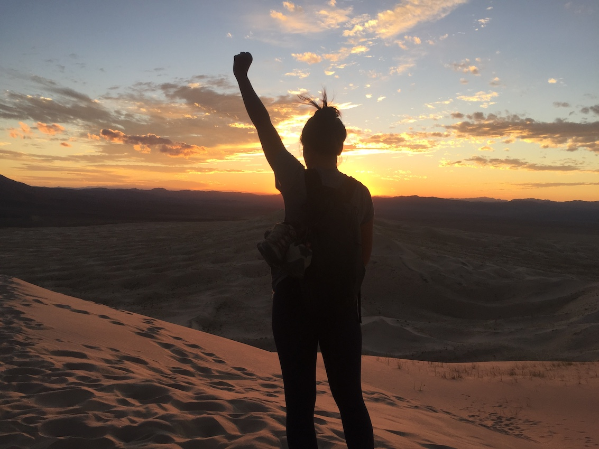{width="30%"} 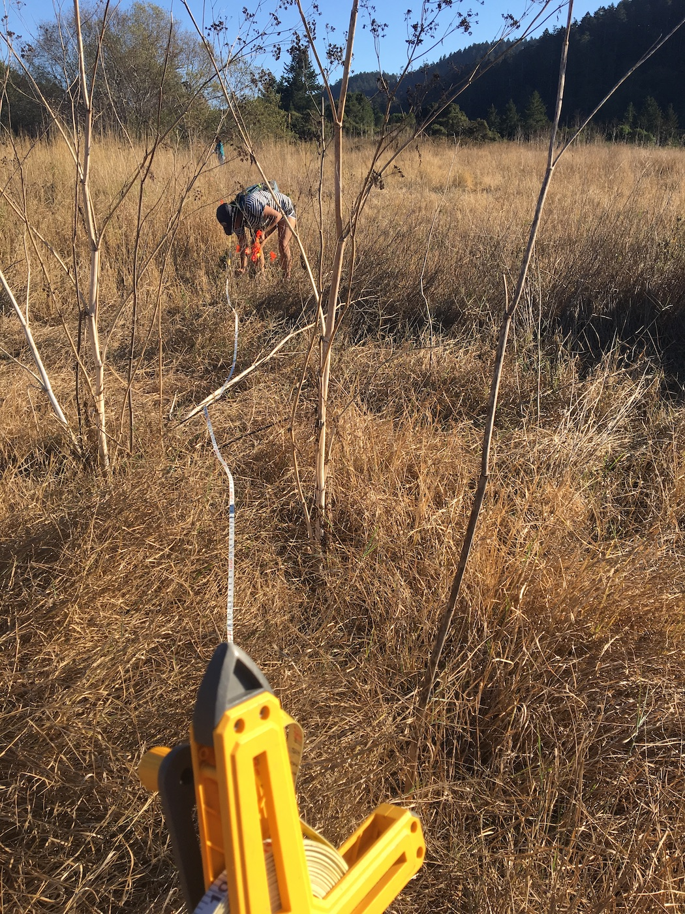{width="30.05%"} 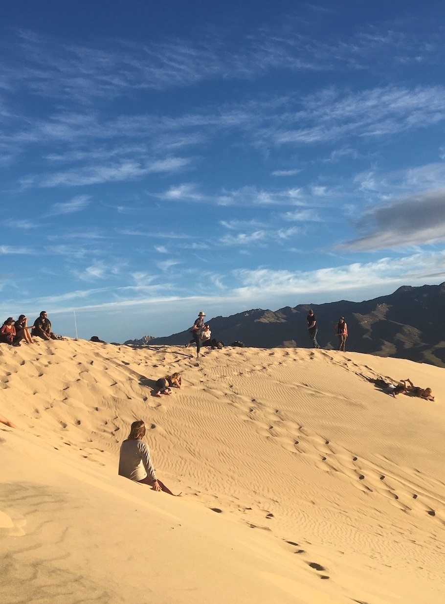{width="29.51%"} 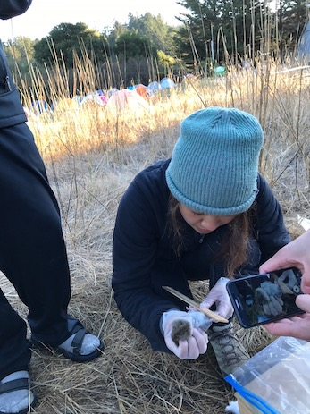{width="30%"} 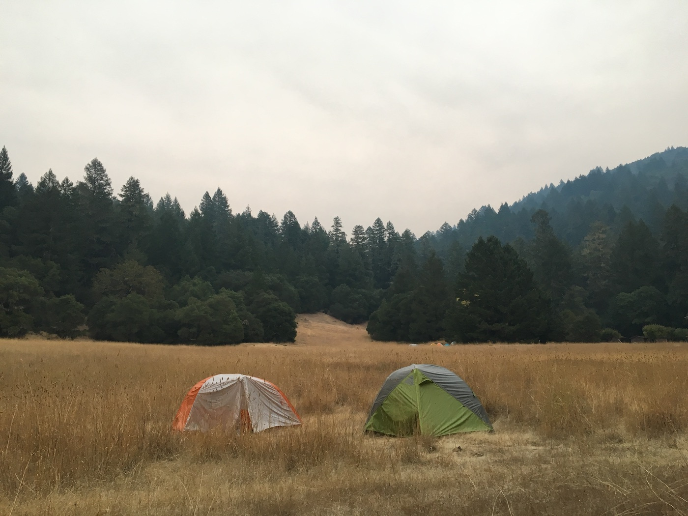{width="30%"} 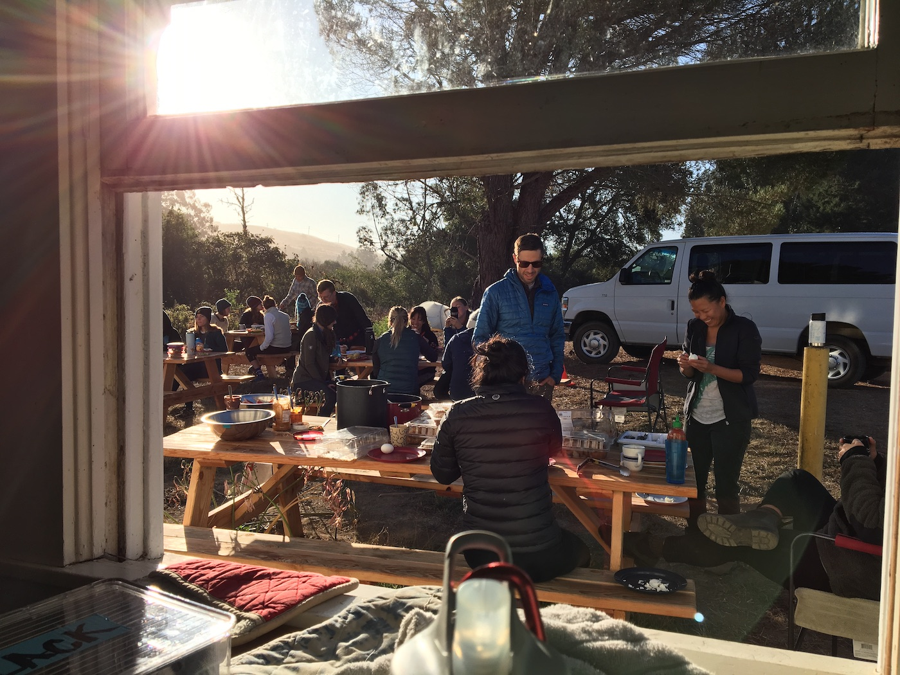{width="30%"} 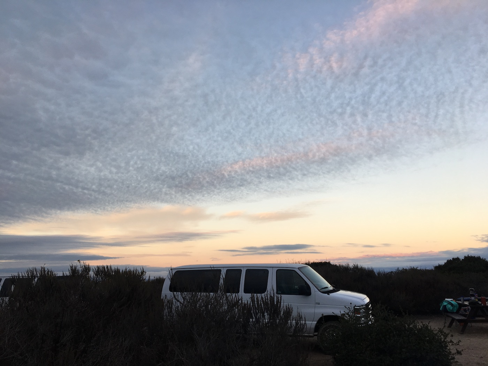{width="30%"}
</center>


In 2018, she moved to Los Angeles to work for Heal the Bay, an environmental non-profit focused on safe, clean water. There she garnered support for environmental campaigns including the Safe, Clean Water Program (Measure W) and The California Circular Economy and Plastic Pollution Reduction Act (SB 54 and AB 1080). These campaigns expanded Halina's knowledge of watershed health, environmental justice, and environmental policy. Though these campaigns were successful, she recognized there were data inaccuracies in representation and in metrics. 

<center>

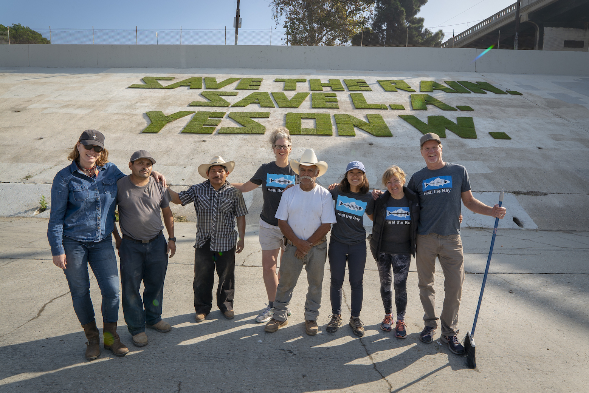{width="70%"}

</center>


To gain the skills to overcome these data challenges, Halina is studying **[Environmental Data Science at the Bren School of Environmental Science & Management](https://bren.ucsb.edu/masters-programs/master-environmental-data-science)**. After Bren, Halina plans to apply her training in data science to finding equitable solutions for environmental issues affecting urban watersheds.